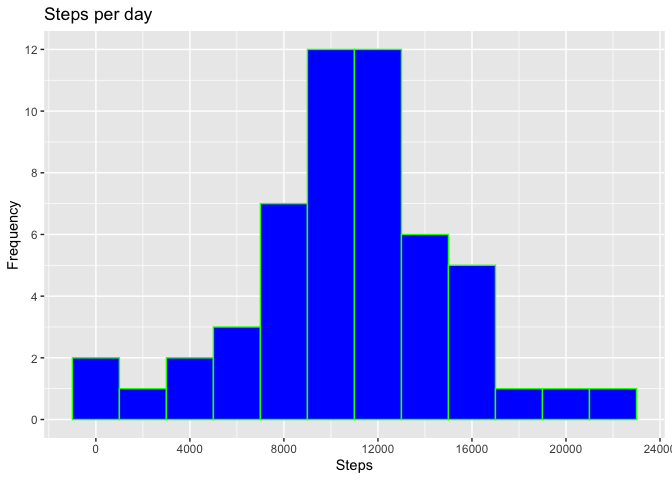
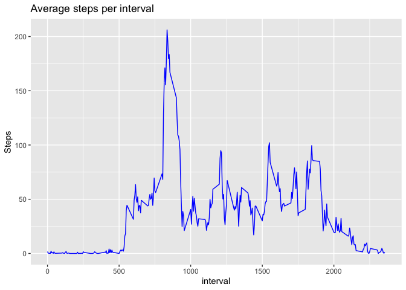
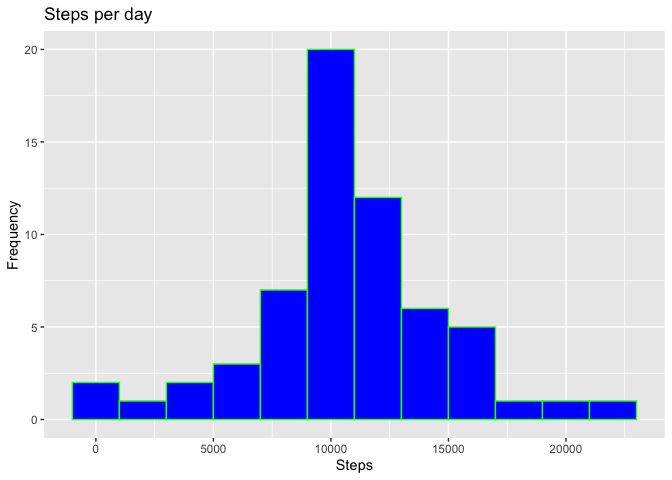
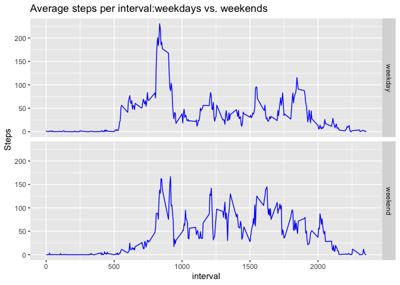

## Loading and preprocessing the data
### Unzip data to obtain a csv file.


```r
library(ggplot2)
library(lubridate)
unzip("activity.zip",exdir = "data")
```
### Load Data

```r
activity <- read.csv("data/activity.csv",stringsAsFactors=FALSE)
```
### Change type of date column to Date

```r
activity$date<-ymd(activity$date)
```

## What is mean total number of steps taken per day?

### Calculate the total number of steps taken per day


```r
stepsPerDay <- aggregate(activity$steps, list(activity$date), FUN=sum)
colnames(stepsPerDay) <- c("Date", "Steps")
head(stepsPerDay)
```

```
##         Date Steps
## 1 2012-10-01    NA
## 2 2012-10-02   126
## 3 2012-10-03 11352
## 4 2012-10-04 12116
## 5 2012-10-05 13294
## 6 2012-10-06 15420
```

### Histogram of the total number of steps taken each day

```r
# draw the histogram
hPlot <- ggplot(stepsPerDay, aes(Steps))
hPlot+
  geom_histogram(fill="blue",col="green",binwidth=2000)+
  ggtitle("Steps per day")+
  xlab("Steps")+
  ylab("Frequency")+
  scale_x_continuous(breaks=seq(0,24000,4000))+
  scale_y_continuous(breaks=seq(0,14,2))
```

<!-- -->

### Calculate and report the mean and median of the total number of steps taken per day

* Mean

```r
mean(stepsPerDay$Steps, na.rm=TRUE)
```

```
## [1] 10766.19
```
* Median


```r
median(stepsPerDay$Steps, na.rm=TRUE)
```

```
## [1] 10765
```

## What is the average daily activity pattern?
### Make a time series plot of the 5-minute interval (x-axis) and the average number of steps taken, averaged across all days (y-axis)

```r
# create steps/interval
stepsPerInterval <- aggregate(steps~interval,data=activity,FUN=mean,na.action=na.omit)
# line plot
lPlot <- ggplot(stepsPerInterval, aes(interval, steps))
lPlot+geom_line(col="blue",type="1")+
  ggtitle("Average steps per interval")+
  xlab("interval")+
  ylab("Steps")
```

<!-- -->

### Which 5-minute interval, on average across all the days in the dataset, contains the maximum number of steps?

```r
stepsPerInterval[which.max(stepsPerInterval$steps),]$interval
```

```
## [1] 835
```

## Imputing missing values
### Calculate and report the total number of missing values in the dataset (i.e. the total number of rows with NAs)


```r
sum(is.na(activity$steps))
```

```
## [1] 2304
```

### strategy for imputing missing data:  5-minute interval


```r
activity$CompleteSteps <- ifelse(is.na(activity$steps), round(stepsPerInterval$steps[match(activity$interval, stepsPerInterval$interval)],0), activity$steps)
```

### create a new dataset that is equal to the original dataset but with the missing data filled in.

```r
# new dataset activityNoNA
activityNoNA <- data.frame(steps=activity$CompleteSteps, interval=activity$interval, date=activity$date)
head(activityNoNA)
```

```
##   steps interval       date
## 1     2        0 2012-10-01
## 2     0        5 2012-10-01
## 3     0       10 2012-10-01
## 4     0       15 2012-10-01
## 5     0       20 2012-10-01
## 6     2       25 2012-10-01
```

### Histogram of the total number of steps taken each day

* Calculate the total number of steps taken per day


```r
stepsPerDayNoNA <- aggregate(activityNoNA$steps, list(activityNoNA$date), FUN=sum)
colnames(stepsPerDayNoNA) <- c("Date", "Steps")
head(stepsPerDayNoNA)
```

```
##         Date Steps
## 1 2012-10-01 10762
## 2 2012-10-02   126
## 3 2012-10-03 11352
## 4 2012-10-04 12116
## 5 2012-10-05 13294
## 6 2012-10-06 15420
```

* draw the histogram


```r
noNAPlot <- ggplot(stepsPerDayNoNA, aes(Steps))
noNAPlot+
  geom_histogram(fill="blue",col="green",binwidth=2000)+
  ggtitle("Steps per day")+
  xlab("Steps")+
  ylab("Frequency")
```

<!-- -->

* Mean and median number of steps taken each day after NA is filled

**Mean**

```r
mean(stepsPerDayNoNA$Steps, na.rm=TRUE)
```

```
## [1] 10765.64
```
  
**Median**


```r
median(stepsPerDayNoNA$Steps, na.rm=TRUE)
```

```
## [1] 10762
```

## Are there differences in activity patterns between weekdays and weekends?

### Create a new factor variable in the dataset with two levels - “weekday” and “weekend” indicating whether a given date is a weekday or weekend day.


```r
# create a variable with weekdays name
activityNoNA$weekday <- weekdays(activityNoNA$date)
# create a new variable indicating weekday or weekend
activityNoNA$dayType <- ifelse(activityNoNA$weekday=='Saturday' | activityNoNA$weekday=='Sunday', 'weekend','weekday')
# see first 6 values
head(activityNoNA)
```

```
##   steps interval       date weekday dayType
## 1     2        0 2012-10-01  Monday weekday
## 2     0        5 2012-10-01  Monday weekday
## 3     0       10 2012-10-01  Monday weekday
## 4     0       15 2012-10-01  Monday weekday
## 5     0       20 2012-10-01  Monday weekday
## 6     2       25 2012-10-01  Monday weekday
```
### Make a panel plot containing a time series plot (i.e. 𝚝𝚢𝚙𝚎 = “𝚕”) of the 5-minute interval (x-axis) and the average number of steps taken, averaged across all weekday days or weekend days (y-axis). See the README file in the GitHub repository to see an example of what this plot should look like using simulated data.


```r
# # create steps/intervale with daytype
stepsPerIntervalDT <- aggregate(steps~interval+dayType,data=activityNoNA,FUN=mean,na.action=na.omit)
head(stepsPerIntervalDT)
```

```
##   interval dayType      steps
## 1        0 weekday 2.28888889
## 2        5 weekday 0.40000000
## 3       10 weekday 0.15555556
## 4       15 weekday 0.17777778
## 5       20 weekday 0.08888889
## 6       25 weekday 1.57777778
```

```r
# draw the line plot
dtPlot <- ggplot(stepsPerIntervalDT, aes(interval, steps))
dtPlot+geom_line(col="blue",type="1")+
  ggtitle("Average steps per interval:weekdays vs. weekends")+
  xlab("interval")+
  ylab("Steps")+
  facet_grid(dayType ~ .)
```

<!-- -->

